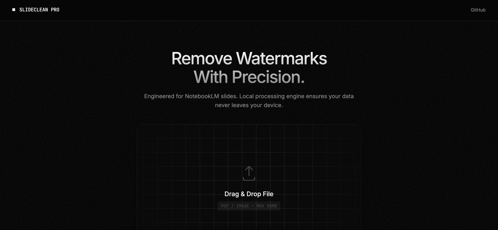

# SlideClean Pro

Remove NotebookLM watermarks from your slides instantly. 100% local processing — your files never leave your device.

🔗 **Live Demo**: [https://aiinfogap.github.io/slideclean/](https://aiinfogap.github.io/slideclean/)

## Features

- **🔒 Privacy First** — All processing happens in your browser. No server uploads, no data collection.
- **⚡ Instant Processing** — Remove watermarks from multi-page PDFs in seconds.
- **🎯 Lossless Quality** — Smart texture cloning algorithm preserves your original slide content.
- **📦 Zero Dependencies** — Single HTML file, works offline, no installation required.

## How It Works

1. Export your NotebookLM presentation as PDF
2. Drag and drop the file into SlideClean Pro
3. Download the clean version

## Technical Details

The tool uses a **texture cloning + edge feathering** algorithm:

1. Locates the watermark region (bottom-right corner)
2. Copies texture from directly above the watermark area
3. Applies 12px alpha gradient blending on edges for seamless transition

This approach preserves background gradients and textures better than traditional inpainting methods.

## Usage

**Online**: Visit [aiinfogap.github.io/slideclean](https://aiinfogap.github.io/slideclean/)

**Offline**: Download `index.html` and open it in any modern browser.

## License

MIT © [AIInfoGap](https://github.com/AIInfoGap)

---

Made with ❤️ for the NotebookLM community
